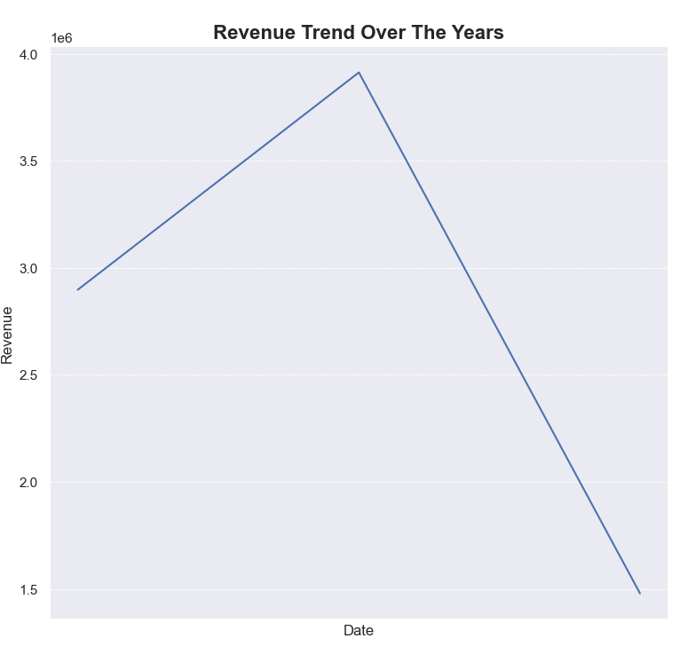
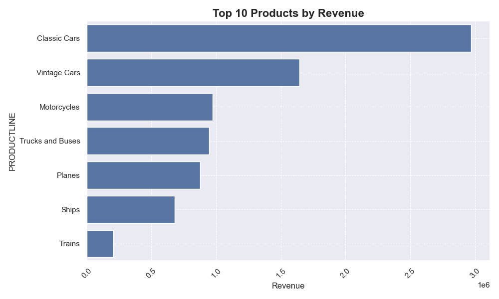
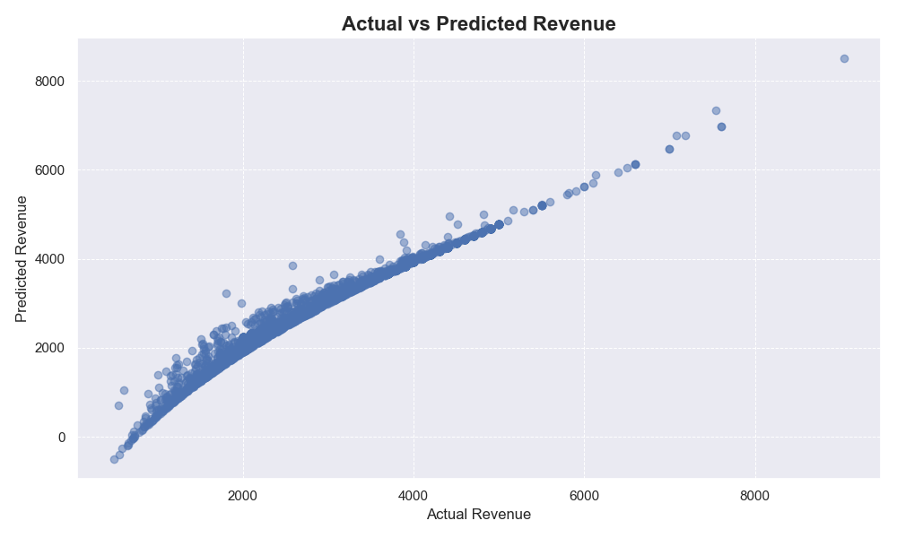

# Sales Data Analysis Project

This project is focused on analyzing sales data to extract insights, visualize trends, and optimize revenue using data science techniques. The analysis involves exploratory data analysis (EDA), product revenue analysis, and a simple linear regression model for revenue prediction.

## Table of Contents
- [Project Overview](#project-overview)
- [Installation](#installation)
- [Data](#data)
- [Features](#features)
- [Usage](#usage)
- [Visualization](#visualization)
- [Modeling](#modeling)
- [Contributing](#contributing)

## Project Overview
This project utilizes a dataset containing sales information and performs the following tasks:
- Cleaning and preprocessing the data.
- Visualizing revenue trends over time.
- Analyzing revenue generated by different products.
- Applying linear regression to predict future revenue based on price and quantity.

## Installation

1. Clone the repository:
   ```bash
   git clone https://github.com/KhayredineG/sales_data_analysis.git
   cd sales_data_analysis
   ```

2. Install the required Python libraries:
   ```bash
   pip install -r requirements.txt
   ```

   The required packages include:
   - `pandas`
   - `numpy`
   - `matplotlib`
   - `seaborn`
   - `scikit-learn`

3. Ensure you have the necessary data files in the project directory.

## Data

The data used in this project is assumed to be in CSV format (`sales_data_sample.csv`). It contains sales transaction records with the following key columns:
- **Date**: The date of the transaction.
- **Product**: The product sold.
- **Quantity**: The number of units sold.
- **Price**: The price per unit.

Make sure to update your `.gitignore` to avoid pushing sensitive data to the repository (especially if it contains customer or proprietary information). 

To ignore your CSV file:
```bash
# Add to .gitignore
*.csv
```

## Features

- **Data Cleaning**: Handle missing values by filling with default values (or `0` in this case).
- **Exploratory Data Analysis**: 
   - Plot the revenue trend over time.
   - Analyze revenue generated by each product.
- **Revenue Optimization using Linear Regression**: 
   - Fit a simple linear regression model using `Price` and `Quantity` as input features.
   - Predict revenue and compare predicted vs. actual revenue.

## Usage

1. Place your sales data in the project directory and ensure the file is named `sales_data_sample.csv`.
   
2. Run the main analysis script:
   ```bash
   python sales.py
   ```

   This will perform the following:
   - Data cleaning and preparation.
   - Revenue trend analysis.
   - Product revenue visualization.
   - Model training and revenue prediction.

## Visualization

### Revenue Trend Over Time
The script generates a time series plot to show the revenue trend over the given period.


### Top 10 Products by Revenue
The bar chart visualization shows the top 10 products that generate the most revenue.


### Actual vs Predicted Revenue
Scatter plot comparing the actual revenue with the predicted revenue using the linear regression model.


## Modeling

A simple linear regression model is built using `scikit-learn` to predict revenue based on two key features:
- **Price**
- **Quantity**

The model output includes:
- Coefficients for `Price` and `Quantity`.
- Predicted revenue for each sales transaction.

## Contributing

Contributions are welcome! Feel free to submit a pull request or open an issue to improve the code or add new features.
